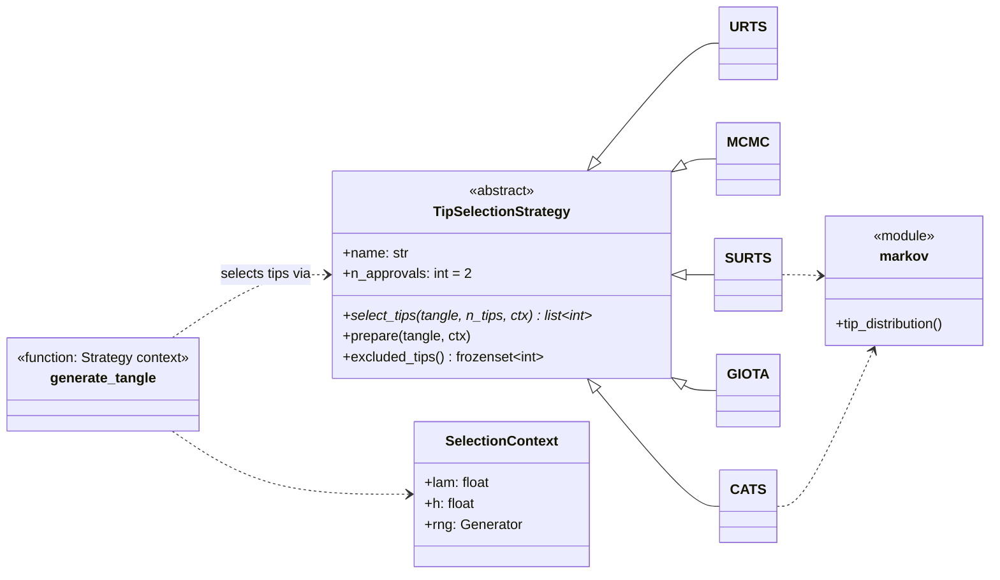

# CATS Tangle Simulator

[](https://github.com/PrimeraAizen/cats_sim/actions/workflows/ci.yml)

[](LICENSE)

A discrete-event simulator for evaluating **tip selection algorithms (TSAs)** on
DAG-based distributed ledgers (IOTA Tangle model). It was used to evaluate
**CATS (Context-Aware Adaptive Tip Selection)** against established baselines under
benign load and parasite-chain attacks.

| Algorithm | `kind` | Idea | Reference |
|---|---|---|---|
| URTS | `urts` | uniform random tip | Popov 2017 |
| MCMC(α) | `mcmc` | weight-biased random walk from 100λ–200λ deep | Popov 2017; Cullen et al. |
| S-URTS | `surts` | absorbing Markov chain over a 500-tx window, drops tips below a threshold, uniform choice | Guo et al. 2025 |
| G-IOTA | `giota` | three approvals, preference for old tips (fairness) | Bu et al. 2019 |
| **CATS** | `cats` | dynamic α from a composite threat signal, adaptive anomaly detection, quarantine with fair reintegration | this work |

| Experiment | Measures | Paper |
|---|---|---|
| `scalability` | mean number of tips under benign conditions, per λ | Table II |
| `security` | p₂: probability that a TSA selects a Simple Parasite Chain (SPC) tip | Table III |
| `adaptive` | CATS α̃(t) response to an SPC, detection rate and latency, false positives | Sec. on adaptive dynamics |

---

## Quick start

Requires Python ≥ 3.11 and [uv](https://docs.astral.sh/uv/getting-started/installation/).

```bash
git clone https://github.com/OWNER/REPO.git cats && cd cats
uv sync --extra plot                                    # locked environment in .venv

uv run cats-sim run configs/smoke.toml -o results/smoke  # seconds: every experiment, tiny
uv run cats-sim run configs/quick.toml                   # minutes: 10 runs per point
uv run cats-sim run configs/paper.toml -o results/paper  # hours: the paper's 100 runs
uv run cats-sim plot results/paper                       # figures from the result files
```

Without uv, the standard toolchain works too, but versions are not locked:

```bash
python -m venv .venv && source .venv/bin/activate
pip install -e ".[plot]"
cats-sim run configs/quick.toml
```

## Usage

```text
cats-sim [-v] run CONFIG [--only EXPERIMENT ...] [--seed N] [--runs N] [-o DIR]
cats-sim plot RESULTS_DIR [--format png|pdf|svg]
cats-sim algorithms
```

- `--only scalability security` runs a subset of the enabled experiments, replacing
  the old practice of commenting code out.
- `--seed` overrides the root seed and `--runs` overrides `num_runs` everywhere (for
  quick checks).
- `python -m cats_sim …` is equivalent to `cats-sim …`.
- Exit codes: `0` success, `1` nothing to plot, `2` configuration error, `3` missing
  optional dependency.

### Configuration

Experiments are described in TOML ([`configs/paper.toml`](configs/paper.toml) is
fully commented). Validation is strict: unknown keys, wrong types and undefined
algorithm names are rejected with a message naming the key.

```toml
[simulation]
seed = 20260403          # root seed; each run derives its own random stream
h = 1.0                  # proof-of-work duration

[algorithms]             # label = { kind = ..., constructor parameters }
URTS     = { kind = "urts" }
MCMC5    = { kind = "mcmc", alpha = 0.05 }
"S-URTS" = { kind = "surts", thresholds = { 5 = 0.035, 15 = 0.01 } }
CATS     = { kind = "cats", kappa = 1.5 }

[experiments.security]   # omit a table or set enabled = false to skip it
algorithms = ["URTS", "S-URTS", "CATS"]
lam = 15
mu = 5
spc_lengths = [10, 30, 50]
num_runs = 100
```

<details>
<summary>All experiment keys and defaults</summary>

| Table | Key | Default | Meaning |
|---|---|---|---|
| `[experiments.scalability]` | `algorithms` | all | labels from `[algorithms]` |
| | `lambdas` | `[5, 10, 15, 20]` | arrival rates λ |
| | `num_transactions` | `2000` | tangle size per run |
| | `warmup` | `200` | transactions skipped before measuring |
| | `num_runs` | `100` | runs per (algorithm, λ) |
| `[experiments.security]` | `algorithms` | all | |
| | `lam`, `mu` | `15`, `5` | honest and attacker rates |
| | `spc_lengths` | `[10, 30, 50]` | parasite chain lengths m |
| | `base_transactions` | `500` | honest tangle size before the attack |
| | `n_samples` | `1000` | tip selections used to estimate p₂ |
| | `num_runs` | `100` | runs per (algorithm, m) |
| `[experiments.adaptive]` | `algorithm` | `"CATS"` | must be a `cats` algorithm |
| | `lam`, `mu` | `15`, `5` | |
| | `spc_length` | `30` | |
| | `num_transactions`, `attach_at` | `1000`, `250` | SPC attached after `attach_at` honest txs |
| | `peak_window` | `50` | selections after the attack searched for the α̃ peak |
| | `num_runs` | `100` | |

Algorithm parameters are the constructor arguments of the classes in
[`src/cats_sim/strategies/`](src/cats_sim/strategies); CATS's defaults are the
paper's reference configuration.
</details>

### Output

`cats-sim run` prints Tables II/III and the adaptive summary, and writes to the
output directory (default `./results`, git-ignored):

| File | Content |
|---|---|
| `results.json` | everything: metadata (package/Python/NumPy versions, platform, UTC time), the resolved configuration incl. seed, all results with per-run values |
| `scalability.csv` | algorithm, λ, mean/std tips |
| `security.csv` | algorithm, m, mean/std p₂ |
| `adaptive_runs.csv` | per run: detected, latency, α̃ peak, quarantine counts |
| `alpha_history.csv` | α̃(t), S(t), σ₁–σ₃ of the representative adaptive run |
| `fig_*.png/pdf/svg` | written by `cats-sim plot` |

## Reproducibility

- **Seeded, independent streams.** Every run draws from its own generator, derived
  from `(seed, experiment, algorithm, parameter, run)`. The same config and seed give
  identical results on the same platform. An experiment run alone gives the same
  numbers as inside the full suite. Both properties are tested.
- **Locked environment.** `uv.lock` pins every package version. `uv sync --locked`
  reproduces it.
- **Provenance.** `results.json` records the configuration, seed and software
  versions. The *Experiments* workflow on GitHub Actions runs a configuration in a
  clean environment and archives the output with the commit it ran on.
- **Equivalence with the original code.** The package is a restructuring of the
  script that produced the published results ([`legacy/test3.py`](legacy/)).
  Deterministic parts are compared with it exactly in CI; stochastic results
  statistically. See [ADR 0010](docs/adr/0010-behaviour-preserving-refactor.md),
  which also lists inherited behaviours that influence the results.

## Architecture



The simulator only knows the `TipSelectionStrategy` interface (the **Strategy
pattern**). Algorithm-specific behaviour is expressed through the interface rather
than `isinstance` checks:

- G-IOTA's three approvals are the `n_approvals` attribute;
- CATS's pre-scan after an attack is the `prepare()` hook;
- its quarantine is `excluded_tips()`.

A **registry** maps the `kind` in configuration files to classes. Experiments build
a fresh strategy per run.

```text
config.toml ─► config.py ─► experiments.py ─► simulation.py ─► strategies/* ─► tangle.py
 (validated)                     │  (A/B/C)       (Poisson + PoW batches)  (markov.py)
                                 ▼
                     reporting.py ─► results.json + CSV ─► plotting.py ─► figures
```

### Adding a tip selection algorithm

```python
# src/cats_sim/strategies/oldest.py
from cats_sim.strategies.base import SelectionContext, TipSelectionStrategy
from cats_sim.tangle import Tangle, TxId


class OldestFirst(TipSelectionStrategy):
    """Always approve the oldest tips."""

    name = "Oldest"

    def select_tips(self, tangle: Tangle, n_tips: int, ctx: SelectionContext) -> list[TxId]:
        return sorted(tangle.tips)[:n_tips]
```

Then add `"oldest": OldestFirst` to `REGISTRY` in `strategies/__init__.py`, add
`"oldest": {}` to `DEFAULT_PARAMS` in `tests/test_strategies.py` (the contract tests
then cover it), and use `{ kind = "oldest" }` in a config. The simulator and
experiments do not change.

## Project structure

```text
├── src/cats_sim/
│   ├── tangle.py             DAG: transactions, tips, cumulative weights, windows
│   ├── markov.py             transition weights, absorbing-chain tip distribution
│   ├── attacks.py            Simple Parasite Chain (optionally Sybil-labelled)
│   ├── strategies/           base.py (interface) + urts, mcmc, surts, giota, cats
│   ├── simulation.py         Poisson arrivals in PoW windows (Strategy context)
│   ├── experiments.py        scalability, security, adaptive + result types
│   ├── seeding.py            per-run random streams
│   ├── config.py             TOML → validated frozen dataclasses
│   ├── reporting.py          tables, JSON/CSV output, provenance metadata
│   ├── plotting.py           figures (optional matplotlib extra)
│   └── cli.py                `cats-sim` command
├── tests/                    unit, property-based, contract, equivalence, CLI tests
├── configs/                  paper / quick / smoke experiment definitions
├── docs/adr/                 architecture decision records (the "why")
├── scripts/                  verify_against_legacy.py (statistical equivalence)
├── legacy/                   the original scripts, byte-for-byte (provenance)
└── .github/                  CI, release and experiment workflows; Dependabot
```

## Development

```bash
uv sync --all-extras                 # package + plot extra + dev tools
uv run pre-commit install            # run the checks on every commit

uv run pytest                        # ~190 tests, ~15 s
uv run pytest --cov                  # with branch coverage (gate: 85%)
uv run ruff check . && uv run ruff format .
uv run mypy                          # strict type checking
uv run pre-commit run --all-files    # everything CI's quality job runs

uv run python scripts/verify_against_legacy.py   # ~15 min, statistical equivalence
```

The test-suite has these layers:

- unit tests against hand-built DAGs with known answers;
- **Hypothesis** property tests of DAG invariants;
- contract tests that every registered strategy must pass;
- characterisation tests pinning inherited behaviour;
- **exact equivalence tests against `legacy/test3.py`**;
- end-to-end CLI tests.

## CI/CD

| Workflow | Trigger | Does |
|---|---|---|
| [`ci.yml`](.github/workflows/ci.yml) | push to `main`, PRs | Ruff, mypy, pytest on Python 3.11–3.14 (Ubuntu) + macOS, coverage gate, end-to-end smoke run with figures, package build + install test |
| [`release.yml`](.github/workflows/release.yml) | tag `vX.Y.Z` | checks the tag against the package version, tests, builds, publishes a GitHub Release with sdist + wheel |
| [`experiments.yml`](.github/workflows/experiments.yml) | manual | runs a chosen config/seed in a clean locked environment, uploads results + PNG/PDF figures (90 days) |
| [`dependabot.yml`](.github/dependabot.yml) | weekly | grouped update PRs for Actions and `uv.lock` |

Releasing: bump `version` in `pyproject.toml`, update `CHANGELOG.md`, commit, then
`git tag v1.0.1 && git push --tags`.

## Design decisions

Every significant choice is recorded with context, alternatives and consequences in
[`docs/adr/`](docs/adr/README.md):

| Decision | Short justification | ADR |
|---|---|---|
| Python + NumPy | validated code exists; reviewers can read it; heavy maths is already compiled | [0001](docs/adr/0001-python-and-numpy.md) |
| src layout, PEP 621, hatchling | tests run against the installed package; one standard config file | [0002](docs/adr/0002-package-layout-and-packaging.md) |
| uv + lock file | exact, cross-platform reproducible environments; fast | [0003](docs/adr/0003-uv-for-environments-and-locking.md) |
| Strategy pattern + registry | algorithms interchangeable without touching the simulator (Open/Closed) | [0004](docs/adr/0004-strategy-pattern-for-tip-selection.md) |
| Seeded per-run `Generator` | reproducible, independent runs; NumPy NEP 19 | [0005](docs/adr/0005-explicit-seeded-randomness.md) |
| TOML + argparse | declarative, commented, strictly validated; no extra dependencies | [0006](docs/adr/0006-toml-configuration-and-cli.md) |
| Ruff, mypy, pytest, Hypothesis, pre-commit | fast, strict, identical checks locally and in CI | [0007](docs/adr/0007-quality-toolchain.md) |
| GitHub Actions + Dependabot | native to the host; CI, releases and archived experiment runs | [0008](docs/adr/0008-ci-cd-github-actions.md) |
| matplotlib as optional extra | light core install; re-plot without re-running | [0009](docs/adr/0009-plotting-as-optional-extra.md) |
| Behaviour-preserving refactor | the paper's numbers must stay valid; verified exactly and statistically | [0010](docs/adr/0010-behaviour-preserving-refactor.md) |

## References

- S. Popov, "The Tangle," ver. 1.3, 2017.
- Cullen et al., "On the resilience of DAG-based distributed ledgers."
- Guo, Hecker, Dustdar, "A scalable and secure tip selection algorithm for DAG-based blockchain," 2025.
- Bu, Gürcan, Potop-Butucaru, "G-IOTA: Fair and confidence aware tangle," 2019.
- Fan et al., "Performance analysis of an IoT-friendly DAG-based distributed ledger system," 2019.

## Citation and license

If you use this simulator, please cite it; GitHub's *Cite this repository* button
uses [`CITATION.cff`](CITATION.cff). Released under the [MIT License](LICENSE).
