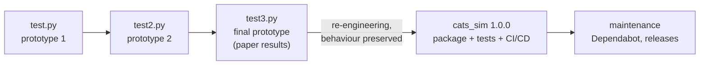
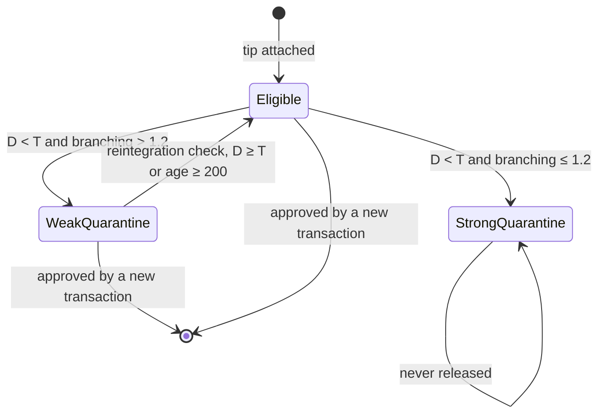
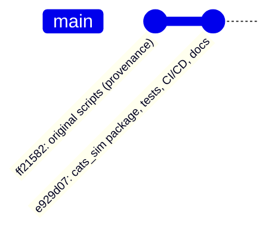
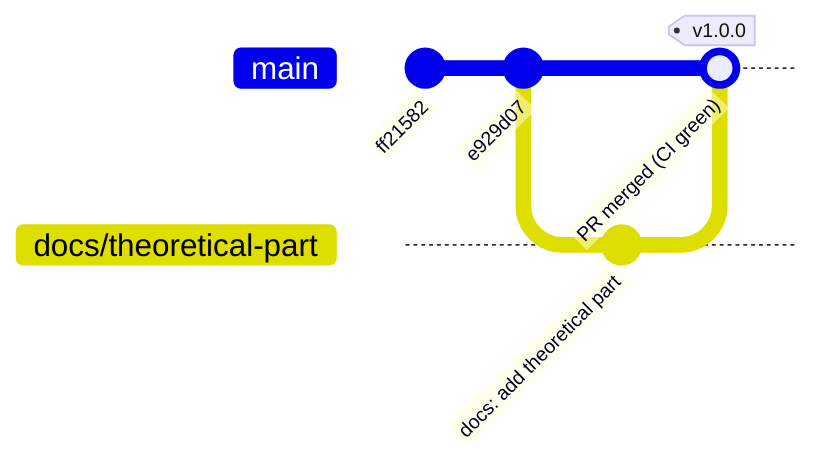
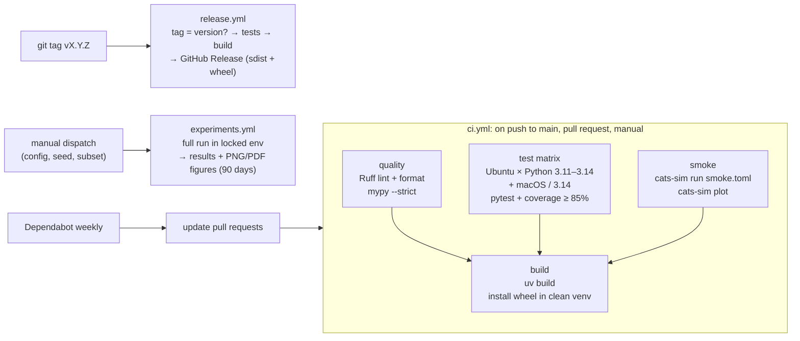

# Theoretical Part: Applied Software Development Project

**Project:** CATS Tangle Simulator, a simulator for evaluating tip selection algorithms on
DAG-based distributed ledgers
**Repository:** <https://github.com/PrimeraAizen/cats_sim>
**Author:** `<Your Name>` · **Course:** Applied Software Development Project · **Date:** October 2026

This document is the theoretical part of the assignment. Each of the five topics is
treated in two layers:

1. **Theory**: the concepts from Lectures 1–5, extended with standard literature
   where the lectures are brief.
2. **Application**: how the concept was applied in the practical part, which turned
   the single research script `test3.py` into the `cats_sim` project. Every claim
   about the project points to a file or a CI run that can be checked.

---

## Contents

0. [How this document addresses the evaluation criteria](#0-how-this-document-addresses-the-evaluation-criteria)
1. [Stages and organization of the software development process](#1-stages-and-organization-of-the-software-development-process)
2. [Criteria for selecting technologies and tools](#2-criteria-for-selecting-technologies-and-tools)
3. [Version control systems: Git and the GitHub platform](#3-version-control-systems-git-and-the-github-platform)
4. [Continuous integration and continuous delivery (CI/CD)](#4-continuous-integration-and-continuous-delivery-cicd)
5. [Features of scientific software development](#5-features-of-scientific-software-development)
6. [Self-analysis](#6-self-analysis)
7. [Conclusion](#7-conclusion)
8. [References](#8-references)

---

## 0. How this document addresses the evaluation criteria

| Criterion (weight) | Where it is addressed | Evidence in the repository |
|---|---|---|
| Theoretical coverage (20%) | Sections 1–5, "Theory" subsections | lectures 1–5 + literature in §8 |
| Justified selection of technologies (15%) | §2 (criteria, decision matrix, tool-by-tool justification) | `docs/adr/0001…0010` |
| Correct use of Git/GitHub (15%) | §3.6–3.7 | commit history, `.gitignore`, `.pre-commit-config.yaml`, `.github/` |
| CI/CD implementation (20%) | §4.5–4.6 | `.github/workflows/*.yml`, CI run [#37929148686](https://github.com/PrimeraAizen/cats_sim/actions/runs/37929148686) |
| Code quality and documentation (15%) | §1.6, §4.5, §5.6 | `src/cats_sim/`, `tests/`, `README.md`, `CHANGELOG.md`, ADRs |
| Formatting and presentation (10%) | structure, tables and diagrams throughout | this document |
| Self-analysis (5%) | §6 | strengths, weaknesses, findings, next steps |

---

## 1. Stages and organization of the software development process

### 1.1 Theory: the software development life cycle (SDLC)

The **software development life cycle** is the ordered set of activities needed to
create, deliver and maintain a software product (Lecture 1). Every process model,
from Waterfall to Scrum, is built from the same **framework activities**:

| # | Stage | Purpose | Typical artifacts |
|---|---|---|---|
| 1 | **Communication** (requirements gathering and analysis) | understand goals, users and constraints | requirements, user stories, use cases, SRS |
| 2 | **Planning** | fix the scope, estimate effort, schedule, assign roles, analyse risks | WBS, Gantt chart, roadmap, backlog, risk register |
| 3 | **Modeling / design** | architecture, module boundaries, interfaces, patterns | UML/ER diagrams, design documents |
| 4 | **Construction** | write the code following standards; version control; CI | source code, unit tests, technical docs |
| 5 | **Testing** | verify functional and non-functional requirements | test reports, defect reports |
| 6 | **Deployment** | release to users, possibly as an MVP or increments | release, release notes, user docs |
| 7 | **Maintenance** | bug fixes, adaptation, performance, security | patches, new versions |

These stages are surrounded by **umbrella activities** that run through the whole
project: requirements and change management, quality management, software
configuration management (version control), risk management, documentation and
information security (Lecture 1).

### 1.2 Theory: process models

A process model decides **how** the stages are ordered and repeated. No model is
universally best. The choice depends on how stable the requirements are, how novel
the technology is, the cost of an error, the budget and time constraints, and the
size of the team (Lecture 1).

| Model | Core idea | Strengths | Weaknesses | Typical use |
|---|---|---|---|---|
| **Waterfall** | strictly sequential phases with a document handed over at each gate | simple to manage; clear milestones; complete documentation | late discovery of defects; changes are expensive | fixed requirements, government contracts |
| **V-model** | each design level has a mirrored test level (requirements ↔ acceptance, architecture ↔ integration, module ↔ unit) | traceability; tests designed early | rigid; high up-front cost | safety-critical systems (medical, aviation) |
| **Spiral** (Boehm, 1988) | repeated loops: objectives → **risk analysis** → prototype/engineering → planning | explicit risk management; early prototypes | needs risk-management expertise; expensive | large, high-uncertainty projects |
| **Iterative** | repeated full mini-cycles that refine the product | flexible; early defect detection; continuous feedback | needs strict version control; the budget is hard to predict | research systems, APIs |
| **Incremental** | a base version, then independent functional increments | an MVP early; each increment has value | integration risk; a "patchwork" architecture | CRM/ERP, SaaS |
| **Evolutionary / prototyping** | an early prototype refined with active user feedback | uncovers hidden requirements | endless prototyping; weak architecture if a prototype is shipped as is | unclear requirements, scientific visualisation |
| **Concurrent** | all activities exist at once, each in a state (inactive, in progress, awaiting changes, done) | shows the real state of a project | high coordination cost | distributed / interdisciplinary teams |
| **Unified Process** | use-case driven, architecture-centric, iterative; phases: Inception, Elaboration, Construction, Transition | stable architecture; controlled growth | can become heavy and bureaucratic | large long-lived systems |

### 1.3 Theory: Agile, Scrum, Kanban and Lean

The **Agile Manifesto** (2001) puts:

- individuals and interactions over processes and tools;
- working software over comprehensive documentation;
- customer collaboration over contract negotiation;
- responding to change over following a plan.

Agile is a philosophy, not a single model. It inherits **cycles and feedback** from
the iterative model and **value-adding increments** from the incremental model.

- **Scrum** works in time-boxed **sprints** (1–4 weeks).
  - Roles: Product Owner, Scrum Master, cross-functional Developers.
  - Artifacts: Product Backlog, Sprint Backlog, Increment.
  - Events: Sprint Planning, Daily Scrum, Sprint Review, Retrospective.
- **Kanban** comes from the Toyota production system. It visualises flow on a board
  (*To Do → In Progress → Testing → Done*) and limits **work in progress** (WIP).
  It has no fixed roles or iterations, so it suits maintenance and research flows.
- **Lean** focuses on eliminating waste, delivering value quickly and continuous
  improvement.

| Criterion | Scrum | Kanban |
|---|---|---|
| Cadence | fixed sprints | continuous flow |
| Roles | prescribed | none prescribed |
| Change | between sprints | at any time |
| Capacity control | velocity per sprint | WIP limits |
| Best for | new product features | support, research, evolution |

### 1.4 Theory: organizing the work

Whatever model is chosen, success depends on managing four universal categories
(Lectures 1–3):

- **Scope.** Define what is in and what is out, to avoid *scope creep*. Scope is
  fixed in an SRS (traditional) or a backlog (Agile). The *iron triangle* of scope,
  time and cost (with quality in the middle) means that changing one parameter
  affects the others (Lecture 2).
- **Requirements** (Lecture 3):
  - Types:
    - *business* requirements answer **why** the system exists;
    - *user* requirements answer **for whom**;
    - *functional* requirements answer **what** it does;
    - *non-functional* requirements answer **how well** it does it.
  - A good requirement is **unambiguous, verifiable, realistic and prioritised**.
  - Tools for capturing them:
    - **user stories** ("As a *role*, I want *action*, so that *benefit*"), which
      should follow **INVEST**: Independent, Negotiable, Valuable, Estimable, Small,
      Testable;
    - **use cases** (actors, goal, preconditions, main flow, alternative flows,
      result).
  - Prioritisation methods: **MoSCoW**, the **Kano model**, the **100-point** method.
  - Changes follow a controlled process: initiation → impact analysis → approval
    (change control board) → implementation → control. Every change is recorded
    in a change log.
- **Risks.** Identify them, analyse probability and impact, then plan a response.
  The spiral model builds this into every loop.
- **Stakeholders.** Customers, users, developers, testers, regulators and funders
  have different interests. A **RACI matrix** (Responsible, Accountable, Consulted,
  Informed) makes responsibilities explicit (Lecture 2).

Planning and control techniques from Lecture 2:

- **WBS**: decompose the project into phases → epics → tasks → subtasks of 1–2 days.
- **Gantt chart**: tasks on a timeline with their dependencies.
- **CPM (critical path method)**: tasks with zero float (*LS − ES = 0*) are on the
  critical path.
- **PERT**: expected duration *E = (O + 4M + P) / 6*. For example, O = 5, M = 7 and
  P = 12 give E = 7.5 days, plus a 10–15% reserve.
- **Quality management**:
  - *Quality assurance* (standards, Definition of Done) → *quality control* (tests,
    reviews, CI/CD) → *continuous improvement* (retrospectives, metrics).
  - Metrics: test coverage (≥ 70% is a good level), defect density, defect removal
    efficiency (DRE), MTTR, and for R&D projects a **reproducibility score** (code,
    data and instructions are all available).

### 1.5 Application: the process model of the CATS project

The project followed an **evolutionary (prototyping) model**. It then moved into a
**Unified-Process-style transition**: the validated prototype was re-engineered
into a maintainable product. This is the pattern Lecture 1 describes for research
software engineering: *"Once the concept is confirmed, the prototype is reworked
into a full-fledged tool, with improved architecture, documentation, and tests."*



**Why this model.** The requirements of a research simulator emerge from the
experiments themselves. The parasite-chain attack model and the CATS adaptive
experiment were refined between `test2.py` and `test3.py`, and Waterfall could not
absorb such changes. Once the science was stable, the *engineering* requirements
became fixed and well understood: reproducibility, tests, CI, documentation. The
re-engineering step was therefore planned as one well-scoped increment.

How the seven SDLC stages map onto the project:

| Stage | What was done in the CATS project | Artifact |
|---|---|---|
| Communication | goals: make the evaluation reproducible and extensible **without changing published results**; decisions with the stakeholder (CI platform, license, legacy files, plotting) | §1.5 requirements below |
| Planning | WBS (below); scope fixed by MoSCoW; key risk identified ("refactoring changes the numbers") with a mitigation (equivalence testing) | WBS and MoSCoW below, ADR 0010 |
| Design | modular-monolith architecture, Strategy + Factory patterns, configuration model | ADR 0002, 0004, 0006 |
| Construction | `src/cats_sim/` written module by module; Ruff, mypy and pre-commit as coding standards | source code |
| Testing | unit, property-based, contract, characterisation, legacy-equivalence and end-to-end tests; statistical verification | `tests/`, `scripts/verify_against_legacy.py` |
| Deployment | wheel/sdist build, GitHub Releases on tags, a manually started experiment workflow | `.github/workflows/` |
| Maintenance | Dependabot, CHANGELOG, Semantic Versioning, ADRs for future decisions | `.github/dependabot.yml`, `CHANGELOG.md` |

**WBS of the re-engineering increment:**

```text
CATS simulator 1.0.0
├── 1 Analysis        1.1 read test3.py  1.2 list behaviours/quirks  1.3 stakeholder decisions
├── 2 Design          2.1 module split   2.2 Strategy interface      2.3 config schema   2.4 ADRs
├── 3 Construction    3.1 model (tangle, markov, attacks)  3.2 strategies  3.3 simulation/experiments
│                     3.4 config/CLI/reporting  3.5 plotting
├── 4 Verification    4.1 unit/property tests  4.2 legacy equivalence  4.3 statistical comparison
├── 5 Delivery        5.1 CI workflow  5.2 release workflow  5.3 experiments workflow  5.4 Dependabot
└── 6 Documentation   6.1 README  6.2 ADRs  6.3 CHANGELOG/CITATION/LICENSE  6.4 theoretical part
```

**Requirements, in the formats of Lecture 3:**

| ID | Type | Requirement | How it is verified |
|---|---|---|---|
| BR-01 | Business | Provide a reproducible, citable evaluation of CATS against URTS, MCMC, S-URTS and G-IOTA that supports the paper | `CITATION.cff`, `results.json` provenance |
| UR-01 | User | A researcher runs any experiment from a configuration file with one command, without editing code | `cats-sim run CONFIG --only …` |
| FR-01 | Functional | Simulate Poisson arrivals in PoW windows for any registered tip selection algorithm | `tests/test_simulation.py` |
| FR-02 | Functional | Run the scalability, security (p₂) and adaptive-response experiments | `tests/test_experiments.py` |
| FR-03 | Functional | Write `results.json` plus CSV tables, and draw figures from them | `tests/test_cli.py`, `tests/test_plotting.py` |
| NFR-01 | Non-functional (reproducibility) | The same configuration and seed give identical results | `test_same_seed_gives_identical_results` |
| NFR-02 | Non-functional (correctness) | Behaviour equivalent to `test3.py` | `tests/test_legacy_equivalence.py`, 20/20 metrics within 3σ |
| NFR-03 | Non-functional (maintainability) | A new algorithm needs no change to the simulator | Strategy pattern; contract tests |
| NFR-04 | Non-functional (portability) | Python 3.11–3.14 on Linux and macOS | CI test matrix |
| NFR-05 | Non-functional (quality) | Branch coverage ≥ 85% and strict static typing | coverage gate, `mypy --strict` |

**User stories (INVEST):**

- *As a researcher, I want to run only the security experiment with a different
  seed, so that I can check the stability of p₂ without editing code.* Acceptance:
  `cats-sim run cfg.toml --only security --seed 7` writes only `results.json` and
  `security.csv`.
- *As a reviewer of the paper, I want to reproduce the tables from a tagged
  version, so that I can verify the claims.* Acceptance: `uv sync --locked` plus the
  same configuration and seed reproduce `results.json` except for its timestamp.
- *As a developer of a new tip selection algorithm, I want to add it by writing one
  class, so that it is compared under identical conditions.* Acceptance: the generic
  contract tests pass for the new strategy.

**Use case: "Run an experiment suite"**

- **Actors:** researcher, `cats-sim`.
- **Precondition:** the environment is created with `uv sync`.
- **Main flow:**
  1. The researcher runs `cats-sim run configs/paper.toml -o results/paper`.
  2. The configuration is validated.
  3. The enabled experiments run, each run with its own random stream.
  4. Tables are printed and the result files written.
  5. `cats-sim plot results/paper` draws the figures.
- **Alternative flows:**
  - An invalid configuration produces a message naming the faulty key (exit code 2).
  - A missing matplotlib produces an installation hint (exit code 3).
- **Result:** a self-describing result directory.

**Prioritisation (MoSCoW):**

| Must have | Should have | Could have | Won't have (this release) |
|---|---|---|---|
| behaviour equivalence, seeded reproducibility, config + CLI, automated tests, CI | plotting, release workflow, ADRs | manually started experiment workflow, Dependabot | parallel execution, Docker image, PyPI publishing, performance rewrite |

**Roles.** This is a single-author research project, so one person combines the
roles of Lecture 2: principal investigator, developer, QA engineer and DevOps
engineer. Automation partly substitutes for the missing roles. CI acts as an
always-available QA engineer, Dependabot as a maintenance assistant and ADRs as
the architect's design record. The simplified RACI is: the author is *Responsible*
and *Accountable* for all tasks; the CI system is *Consulted*, since it blocks
merges when quality gates fail; future readers of the paper are *Informed* through
the README, CHANGELOG and releases.

**Definition of Done for a change:**

- CI is green: lint, types, tests on every Python version, smoke run, build.
- Tests have been added or updated.
- The README, ADR or CHANGELOG is updated when behaviour or a decision changes.
- No unexplained change in the equivalence or characterisation tests.

### 1.6 Application: design stage (architecture and patterns, Lecture 4)

**Architectural style: a modular monolith.** Lecture 4 compares monolithic,
microservice and event-driven architectures. The simulator is a single-process,
CPU-bound batch tool used by one researcher at a time. It has no requests to scale,
no independent teams and no real-time events. A monolith gives a simple
infrastructure, uniform deployment and easy testing. Its usual weakness, coupling,
is countered by a strict internal module structure with one-way dependencies:

```text
tangle ← markov ← strategies ← simulation ← experiments ← reporting / plotting ← cli
```

Microservices or an event bus would add network latency and DevOps overhead
without solving any real problem (Lecture 4, §3).

**Design patterns.**

| Pattern (category) | Where | Why |
|---|---|---|
| **Strategy** (behavioural, GoF) | `strategies/base.py`: `TipSelectionStrategy` with URTS, MCMC, S-URTS, G-IOTA, CATS | Interchangeable algorithms behind one interface. It removes the `isinstance(tsa, CATS)` branching of `test3.py` (Open/Closed principle). Algorithm-specific behaviour is expressed as data (`n_approvals`) and hooks (`prepare()`, `excluded_tips()`) |
| **Factory / registry** (creational; a simple form of the lecture's Factory Method) | `strategies.REGISTRY`, `create_strategy(kind, **params)` | Objects are created from configuration without hard-coding concrete classes, which is exactly the motivation Lecture 4 gives for factory patterns |
| **Parameter object** | `SelectionContext(lam, h, rng)` | One uniform signature instead of `**kwargs` that differ per algorithm |
| *Singleton, deliberately avoided* | — | The original used NumPy's **global** random state, in effect a singleton. Lecture 4 notes that singletons and global state make testing difficult. It was replaced by **dependency injection** of a `numpy.random.Generator` |
| Separation of model, presentation and control (similar to MVC) | model: `tangle/strategies/simulation`; view: `reporting/plotting`; control: `cli` | The model never imports I/O code, so it can be tested in isolation |

**State-based modelling (Lecture 4, §5).** The CATS quarantine is a small finite
state machine. Writing it down made the reintegration rules testable
(`test_reintegration_rules`):



---

## 2. Criteria for selecting technologies and tools

### 2.1 Theory: selection criteria

Lecture 5 names four primary criteria for choosing languages, frameworks and tools:

- **Performance**: computational requirements may favour compiled languages
  (C++, Rust) for real-time systems or numerical simulation.
- **Scalability**: growth in data volume, users or complexity should not require
  re-engineering.
- **Community support**: libraries, tutorials and updates reduce risk and speed up
  problem solving.
- **Compatibility**: integration with existing infrastructure, operating systems
  and services, to avoid costly refactoring.

In practice these are complemented by further criteria:

| Additional criterion | Question it answers |
|---|---|
| Maturity and stability | Is the API stable? Is the project actively maintained, with a clear release policy? |
| Team competence and learning curve | Can the team be productive now? Can collaborators read the code? |
| Licensing and cost | Is the license compatible with the intended publication or distribution? Are there fees? |
| Reproducibility support | Can the exact environment be recreated later? (critical for science, §5) |
| Maintainability and longevity | Will the tool still exist and be supported for the lifetime of the results? |
| Security and supply chain | Are dependencies few, trusted and kept up to date? |
| Fit with existing assets | Does a validated implementation or dataset already exist in some technology? |

### 2.2 Theory: making and recording a decision

A transparent selection process has four steps:

1. List the candidate options.
2. Weight the criteria according to the project's priorities.
3. Score each option on each criterion (a **weighted decision matrix**, also called
   multi-criteria decision analysis).
4. Check how sensitive the result is to the weights.

The decision and its reasoning should be recorded where the code lives. The
industry-standard format is the **Architecture Decision Record** (ADR; Nygard,
2011): *context → decision → alternatives considered → consequences*. ADRs are
immutable; a change of mind is a new ADR that supersedes the old one, so the
reasoning history is preserved.

### 2.3 Application: choice of programming language

A weighted decision matrix for the implementation language. Scores from 1 to 5 are
the author's assessments, explained below the table.

| Criterion | Weight | Python | C++ | Julia | Rust |
|---|---:|---:|---:|---:|---:|
| Continuity with the validated implementation (`test3.py`) | 0.25 | 5 | 1 | 1 | 1 |
| Community support / scientific ecosystem | 0.20 | 5 | 4 | 3 | 3 |
| Readability for reviewers (correctness can be checked against equations) | 0.15 | 5 | 2 | 4 | 2 |
| Performance | 0.15 | 2 | 5 | 5 | 5 |
| Compatibility (OS, CI, tooling) | 0.10 | 5 | 4 | 3 | 4 |
| Scalability (larger simulations) | 0.10 | 3 | 5 | 4 | 5 |
| Team competence | 0.05 | 5 | 3 | 2 | 2 |
| **Weighted score** | 1.00 | **4.35** | 3.15 | 3.00 | 2.90 |

**Reasoning.**

- Rewriting in any other language would mean re-validating every algorithm whose
  output the paper already reports. That is the dominant risk, so continuity has
  the highest weight.
- Python is slow in pure-Python loops. However, the most expensive operation, the
  power iteration over a 500×500 transition matrix, already runs inside NumPy's
  compiled kernels.
- **Sensitivity check:** doubling the weight of performance (0.30) and reducing
  continuity to 0.10 still ranks Python first: 3.90 against C++ 3.75, Julia 3.60
  and Rust 3.50. The decision is robust to reasonable changes of weights.

Decision: **Python ≥ 3.11 with NumPy as the only runtime dependency** (ADR 0001).
Python 3.11 is the floor because it brings `tomllib` to the standard library.

### 2.4 Application: choice of every other tool

| Need | Options considered | Chosen | Decisive criteria | ADR |
|---|---|---|---|---|
| Package layout and metadata | flat layout + `setup.py`; Poetry; **src layout + `pyproject.toml` (PEP 621) + hatchling** | src layout + PEP 621 + hatchling | standards-based (compatibility); tests run against the *installed* package (quality); small, maintained backend (longevity) | 0002 |
| Dependency and environment management | pip + `requirements.txt`; pip-tools; conda; Poetry; **uv** | **uv + `uv.lock`** | exact, universal lock file covering all Python versions and platforms (reproducibility); speed in CI (performance); standard metadata, so `pip install` still works (compatibility) | 0003 |
| Random numbers | global `np.random`; `RandomState`; **`Generator` + `SeedSequence`** | `Generator` + `SeedSequence` | NumPy's recommended API (NEP 19, maturity); independent per-run streams (reproducibility, scalability to parallel runs) | 0005 |
| Configuration | YAML; JSON; Hydra; **TOML (`tomllib`)** | TOML | comments allowed (essential for research configs); standard library (no dependency); TOML is the Python standard (`pyproject.toml`) | 0006 |
| Command-line interface | Click; Typer; **argparse** | argparse | zero dependencies; sufficient for three sub-commands | 0006 |
| Linting and formatting | flake8 + isort + black + pyupgrade; **Ruff** | Ruff | one fast tool covering all four (performance, simplicity); large community | 0007 |
| Static typing | pyright; **mypy** | mypy (`strict`) | reference implementation; common CI gate; catches interface mismatches between strategies | 0007 |
| Testing | unittest; **pytest + Hypothesis + pytest-cov** | pytest + Hypothesis + pytest-cov | de-facto standard (community); fixtures and parametrisation; property-based testing of DAG invariants | 0007 |
| Commit-time checks | manual; **pre-commit** | pre-commit | the same checks locally and in CI ("shift left") | 0007 |
| CI/CD | Jenkins; GitLab CI; Travis CI; **GitHub Actions** | GitHub Actions | native to the chosen host (compatibility); hosted Linux and macOS runners; free for public repositories (cost) | 0008 |
| Plotting | Plotly; seaborn; **matplotlib (optional extra)** | matplotlib as an optional extra | static vector figures for the paper; optional, so the core install stays light | 0009 |
| Project management | Jira; Trello; MS Project; **GitHub Issues/Projects** | GitHub Issues/Projects | single developer: tasks linked to commits and pull requests at no cost; Jira or MS Project only pay off for teams or grant reporting (Lecture 2, §5) | — |

Lecture 5 lists pip, conda, Maven and npm as the dependency managers of their
ecosystems. Among the Python options:

| | pip + requirements.txt | conda | Poetry | **uv** |
|---|---|---|---|---|
| Lock file including transitive dependencies | only with pip-tools | not by default | yes | **yes, universal** |
| Manages the Python interpreter itself | no | yes | no | **yes** |
| Non-Python binaries (C libraries, CUDA) | no | **yes** | no | no |
| Uses standard `pyproject.toml` metadata | partly | no | historically its own format | **yes** |
| Speed | medium | slow | medium | **fast** |

conda would be the right choice if the project depended on non-Python binaries.
This one does not, so uv's universal lock file and speed are decisive.

---

## 3. Version control systems: Git and the GitHub platform

### 3.1 Theory: what version control is for

A version control system (VCS) records the history of changes to files. It lets you:

- go back to any earlier state;
- work in parallel on branches;
- merge contributions;
- attribute every change to an author with a message explaining why;
- mark released versions.

In the SDLC, version control is the core of *software configuration management*,
one of the umbrella activities (Lecture 1). For research software it is also the
basis of **provenance**: a result can be traced to the exact code that produced it.

Three generations of architecture exist:

| Architecture | Principle | Examples |
|---|---|---|
| Local | history kept on one machine | RCS |
| **Centralized (CVCS)** | one server holds the history; clients check out working copies; most operations need the server | CVS, **Apache Subversion (SVN)**, **Perforce Helix Core** |
| **Distributed (DVCS)** | every clone contains the **complete history**; commit, branch and log work offline and are synchronised later | **Git**, **Mercurial** |

A DVCS is resilient (every clone is a backup), allows offline work and makes
branching cheap (Lecture 5).

### 3.2 Theory: comparison of popular version control systems

| Feature | **Git** | Mercurial | Subversion (SVN) | Perforce Helix Core |
|---|---|---|---|---|
| Model | distributed | distributed | centralized | centralized |
| Created | 2005 (L. Torvalds, for the Linux kernel) | 2005 | 2000 | 1995 |
| Branching | very cheap (a branch is a pointer to a commit) | cheap | a directory copy on the server | streams; server-side |
| Offline commits and history | yes | yes | no | no |
| Large binary files | weak without **Git LFS** | weak (largefiles extension) | good | **very good** (file locking) |
| Fine-grained access control | per repository | per repository | per path | per path |
| Learning curve | steep (staging area, rebase) | gentler | gentle | moderate |
| Adoption | dominant in industry and open source | niche; Bitbucket dropped Mercurial in 2020 | legacy enterprise systems | game development, very large monorepos |
| Cost | free, GPL | free, GPL | free, Apache | commercial |

**Conclusion.** Git is the default choice for new software, and especially for
open, collaborative and scientific code. It is free and fast, it works offline and
has cheap branching, and its hosting ecosystem dominates. Centralized systems keep
an advantage for very large binary assets with exclusive file locks, which this
project does not have.

### 3.3 Theory: core Git concepts

- **Three areas**: the *working tree* (files on disk), the *staging area / index*
  (the next snapshot being prepared, via `git add`) and the *repository* (the
  committed history in `.git`).
- **Commit**: an immutable snapshot of the whole tree. It has a unique hash, a
  parent or parents, an author and a message.
- **Branch**: a movable pointer to a commit, for work isolated from `main`.
  `HEAD` points to the current branch.
- **Merge**: combines the histories of two branches, possibly with conflicts to
  resolve. **Rebase** instead replays commits on a new base and gives a linear
  history. Published history should not be rebased.
- **Tag**: a fixed name for a commit, usually a release (`v1.0.0`). *Annotated*
  tags store an author, date and message.
- **Remote**: another copy of the repository (`origin`), synchronised with
  `fetch`, `pull` and `push`.
- **`.gitignore`**: patterns for files that must never be versioned (virtual
  environments, caches, generated results, secrets).

**Commit and versioning conventions:**

- Small, focused commits with imperative messages that explain *why*.
- **Semantic Versioning** (`MAJOR.MINOR.PATCH`): incompatible changes, new
  features, fixes.
- A curated **CHANGELOG** (the *Keep a Changelog* format).
- Optionally, **Conventional Commits** (`feat:`, `fix:`, `docs:`), so release
  notes can be generated automatically.

### 3.4 Theory: branching strategies

| Strategy | Branches | Release style | Fits |
|---|---|---|---|
| **Git Flow** (Driessen, 2010) | `main`, `develop`, `feature/*`, `release/*`, `hotfix/*` | scheduled, versioned releases | products with parallel supported versions |
| **GitHub Flow** | `main` + short-lived feature branches merged through pull requests | continuous; `main` is always deployable | web services, small teams, research code |
| **Trunk-based development** | everyone commits to `main` very often; branches live hours; unfinished work hidden behind feature toggles | continuous integration taken to the limit | experienced teams with strong automated tests |

The strategy is chosen by project size, release cycle and team structure
(Lecture 5). Git Flow's long-lived branches delay integration, which conflicts
with the CI idea of integrating often (§4). The lighter strategies are therefore
the modern default.

### 3.5 Theory: Git versus GitHub, and hosting platforms

**Git** is the version control *tool*. **GitHub** is a *hosting and collaboration
platform* built around Git repositories. GitHub adds:

- **pull requests** with code review and required status checks;
- **issues** and **Projects** (Kanban boards) linked to code;
- **GitHub Actions** (CI/CD) and **Dependabot** (automated dependency updates);
- **Releases** with attached build artifacts;
- **branch protection** rules and **CODEOWNERS**;
- **Pages**, **Discussions**, and recognition of a `CITATION.cff` file ("Cite this
  repository").

| Platform | Built-in CI/CD | Self-hosting | Notable strengths |
|---|---|---|---|
| **GitHub** | GitHub Actions (Linux, Windows and macOS hosted runners) | GitHub Enterprise Server | largest open-source community; Marketplace; Dependabot; research-friendly (Zenodo integration for DOIs) |
| **GitLab** | GitLab CI/CD (`.gitlab-ci.yml`) | **open-source Community Edition** | one application for the whole DevOps cycle; common in universities that self-host |
| **Bitbucket** | Bitbucket Pipelines | Data Center | tight integration with Jira and Confluence (Atlassian) |
| Gitea / Forgejo (Codeberg) | Actions-compatible runners | yes, lightweight | small footprint; community-run hosting |

### 3.6 Theory: best practices for team version control

Lecture 5 lists these practices:

- Commit small, frequent changes with meaningful messages.
- Use a branching strategy that matches the workflow.
- Require peer review through pull requests.
- Tag releases consistently for reproducibility.
- Synchronise with `main` regularly to minimise conflicts.
- **Protect critical branches** with permissions and required automated checks.

To these add:

- Never commit secrets or generated artifacts; use `.gitignore`.
- Commit the **lock file**, so that history pins the environment as well as the code.
- Run checks *before* a commit is created (pre-commit hooks).

### 3.7 Application: how Git and GitHub are used in the CATS project

**Repository:** <https://github.com/PrimeraAizen/cats_sim> (public, default branch `main`).

**History designed for provenance.** The first commit stores the original scripts
byte for byte. The restructuring is a separate commit on top. Anyone can therefore
diff the published code (`legacy/test3.py`) against the package, and the legacy
README records the SHA-1 checksums of the scripts.



| Practice | How it is applied | File |
|---|---|---|
| Ignore generated and local files | `.venv/`, caches, `results/`, `dist/`, coverage files are never versioned | `.gitignore` |
| Version the environment | `uv.lock` is committed, so every commit pins exact dependency versions | `uv.lock` |
| Checks before every commit | pre-commit runs whitespace/YAML/TOML hygiene, Ruff and mypy; the `legacy/` folder is excluded so that it is never rewritten | `.pre-commit-config.yaml` |
| Versioning and change history | Semantic Versioning (`1.0.0`), Keep a Changelog | `pyproject.toml`, `CHANGELOG.md` |
| Releases from tags | pushing `vX.Y.Z` triggers the release workflow; it refuses tags that do not match the package version | `.github/workflows/release.yml` |
| Automated dependency updates | Dependabot checks GitHub Actions and `uv.lock` weekly and groups updates into pull requests. Its first runs completed successfully | `.github/dependabot.yml` |
| Citation metadata | GitHub renders "Cite this repository" from `CITATION.cff` | `CITATION.cff` |
| Decision log in the repository | ADRs version design decisions together with the code | `docs/adr/` |

**Recommended workflow from now on: GitHub Flow.** A single author does not need
Git Flow's `develop` and `release` branches. Every further change (including this
document) should go through a short-lived branch and a pull request, so that CI
runs *before* the change reaches `main`:



The two practices not yet applied (branch protection and tagged releases) are
discussed honestly in the self-analysis (§6.2).

---

## 4. Continuous integration and continuous delivery (CI/CD)

### 4.1 Theory: definitions

- **Continuous Integration (CI)**: developers merge their changes into a shared
  repository frequently, at least daily. Every merge triggers an automated build
  and test run, so integration errors are found within minutes instead of at the
  end of a project (Fowler, 2006; Lecture 5).
- **Continuous Delivery**: every change that passes the pipeline is *releasable*.
  Build, test and packaging are automated; the release to production is a manual
  business decision (Humble & Farley, 2010).
- **Continuous Deployment**: every validated change is deployed to production
  automatically, with no manual step.

```text
commit → build → test → package → [manual approval] → release      (continuous delivery)
commit → build → test → package → release automatically             (continuous deployment)
```

### 4.2 Theory: core practices

| Practice | Meaning |
|---|---|
| Single source repository | all code, configuration, the lock file and the pipeline definition are versioned together ("pipeline as code") |
| Automated, self-testing build | one command builds and verifies the system |
| Fast feedback | the main pipeline should finish in minutes; slow jobs run separately or in parallel |
| Fix a broken build immediately | a red `main` blocks everyone; it is the team's top priority |
| **Quality gates** | lint, static analysis, tests and a coverage threshold must pass before a merge |
| Test pyramid | many fast unit tests, fewer integration tests, few end-to-end tests |
| Build once, promote the same artifact | the tested package is the one that gets released |
| Reproducible environments | locked dependencies, pinned runner images, containers |
| Production-like testing | test on the platforms and versions users actually run |
| **Shift left** | checks run as early as possible: editor → pre-commit → CI |
| Pipeline security | least-privilege tokens, secrets in a vault, trusted or pinned third-party actions, no shell interpolation of untrusted input |

**Measuring delivery performance (DORA metrics; Forsgren, Humble & Kim, 2018):**

- deployment frequency;
- lead time for changes;
- change failure rate;
- time to restore service (compare MTTR in Lecture 2).

High-performing teams improve all four at once: speed and stability are not a
trade-off.

**Benefits (Lecture 5):** higher software quality, because defects are found early
and cheaply; reproducibility, because builds run in consistent environments;
deployment speed, through short feedback loops; and reliability, because small
increments carry a low risk.

### 4.3 Theory: CI/CD tools

| Tool | Hosting | Configuration | Strengths | Limitations |
|---|---|---|---|---|
| **GitHub Actions** | hosted runners (Linux, Windows, macOS) or self-hosted | YAML in `.github/workflows/` | native to GitHub; large Marketplace; matrix builds; free for public repositories | tied to GitHub |
| **GitLab CI/CD** | GitLab.com or self-managed | `.gitlab-ci.yml` | integrated DevOps platform; strong container support | tied to GitLab |
| **Jenkins** | self-hosted (Java server) | `Jenkinsfile` (Groovy) | extremely flexible; huge plugin ecosystem; on-premise | operating cost; plugin maintenance |
| **Travis CI** | hosted | `.travis.yml` | historically popular for open source | free plan for open source reduced in 2020; many projects migrated |
| CircleCI | hosted or self-hosted | `.circleci/config.yml` | fast; good caching | usage-based pricing |

### 4.4 Theory: CI/CD for research software

For scientific code, CI does more than check that the code still works. It also
continuously checks that **the results are still the same**:

- regression tests against reference outputs or reference implementations;
- small "smoke" versions of the real experiments;
- the archiving of results produced in a clean environment.

Lecture 5 describes a machine-learning pipeline built this way: data validation →
reproducible training → evaluation against benchmarks → packaging and deployment.

### 4.5 Application: the CI/CD pipeline of the CATS project

The project has three GitHub Actions workflows and Dependabot.



| Workflow | Type | Practice demonstrated |
|---|---|---|
| `ci.yml`, job **quality** | CI | static quality gate (lint, format, strict typing) |
| `ci.yml`, job **test** | CI | test pyramid; production-like matrix (all supported Python versions; Linux and the developer's macOS); coverage gate; `fail-fast: false` so every failing version is reported |
| `ci.yml`, job **smoke** | CI, end-to-end | runs the real deliverable on a tiny configuration and keeps its output as an artifact |
| `ci.yml`, job **build** | build verification | builds the wheel *and installs it into a clean environment*. This catches packaging errors that tests on the source tree cannot see. It runs only when the other jobs pass (`needs:`) |
| `release.yml` | **continuous delivery** | an automated, tested, versioned release. Creating the tag is the deliberate manual decision that separates continuous delivery from continuous deployment (Lecture 5) |
| `experiments.yml` | research delivery | runs the full experiments in a clean, locked environment. The results are tied to the exact commit, which makes the paper's figures traceable |
| `dependabot.yml` | maintenance | supply-chain hygiene: grouped weekly updates of Actions and `uv.lock`, each checked by CI |

**Practices visible in the configuration:**

- Least-privilege `permissions: contents: read`; only the release job gets
  `contents: write`.
- `concurrency` cancels superseded runs.
- `uv sync --locked` fails if the lock file is outdated, so CI always uses exactly
  the locked environment.
- The uv cache is enabled.
- Workflow inputs are passed through environment variables instead of being
  interpolated into shell code, to prevent script injection.
- The workflows were validated with **actionlint** before the first push.

**Evidence.** The first pipeline run on GitHub,
[run 37929148686](https://github.com/PrimeraAizen/cats_sim/actions/runs/37929148686),
succeeded with **all 8 jobs green in 1 min 34 s**: quality, 5 test jobs, smoke and
build. Locally, the same checks give:

| Check | Result |
|---|---|
| Tests | **193 passed** in about 11 s |
| Branch coverage | **97.3%** (gate: 85%) |
| Ruff lint + format | clean |
| mypy `--strict` | no issues in 36 source files |
| Legacy equivalence (exact) | deterministic components identical to `test3.py` |
| Statistical equivalence (`scripts/verify_against_legacy.py`) | **20/20 metrics within 3σ** (20 runs each) |

### 4.6 Application: what the pipeline protects against

| Risk | Pipeline safeguard |
|---|---|
| A refactoring silently changes the published numbers | exact legacy-equivalence tests and characterisation tests run on every push |
| "Works on my machine" | locked environment; Linux and macOS runners; four Python versions |
| A broken package or missing files | the build job installs and runs the built wheel |
| Lost provenance of figures | `experiments.yml` artifacts plus metadata in `results.json` |
| Outdated or vulnerable dependencies | Dependabot plus CI on every update |
| Style drift and type errors | Ruff and mypy in pre-commit and in CI |

---

## 5. Features of scientific software development

### 5.1 Theory: what makes research software different

Research Software Engineering (RSE) combines software engineering with the
specifics of scientific work. Its goal is high-quality, reliable, reproducible and
maintainable code (Lecture 1). Compared with commercial products:

| Aspect | Commercial software | Research software |
|---|---|---|
| Goal | a product that delivers value to users | **new knowledge**: results, methods, publications, datasets (Lecture 2) |
| Requirements | negotiated, relatively stable | incomplete and changing as hypotheses evolve |
| Typical life cycle | planned releases | rapid prototyping, then consolidation into a tool |
| Measure of correctness | meets the specification | **scientifically valid results**, and often no known "correct answer" exists (the *oracle problem*) |
| Key quality attributes | usability, availability, scalability | **reproducibility, transparency, numerical correctness**, efficiency |
| Authors | professional developers | often domain scientists with little engineering training |
| Success metrics (KPIs) | time, budget, features | publications, open data and code, reproducibility score (Lecture 2) |
| Funding and lifetime | product budget | grants; must outlive the project for as long as the results are cited |

### 5.2 Theory: requirements specific to scientific software

**Reproducibility** comes first: the computation behind a published result must be
repeatable. *The Turing Way* distinguishes four related properties:

| | Same data | Different data |
|---|---|---|
| **Same analysis / code** | *reproducible* | *replicable* |
| **Different analysis / code** | *robust* | *generalisable* |

Further requirements (Lecture 5):

- **Transparency**: methods, code and data are documented and accessible for peer
  review.
- **Efficiency**: large simulations and data-intensive analyses need computational
  performance.
- **Numerical correctness**: seeded random numbers, control of floating-point
  effects, and validation against analytic or known solutions.
- **Provenance**: every result is linked to the exact code version, parameters,
  environment and input data.
- **Long-term usability and citability**: a license, citation metadata and a
  persistent identifier (DOI).

Lecture 5 lists the typical threats to reproducibility:

- **dependency drift** (library updates change results);
- **data availability**;
- **hardware differences** (CPU, GPU, HPC);
- **documentation gaps** (missing parameters or preprocessing steps).

### 5.3 Theory: environments

| Layer | Tools | Purpose |
|---|---|---|
| Interactive exploration | Jupyter Notebooks, RStudio | combine code, results and narrative; teaching; analysis (Lecture 5) |
| Language-level environments | `venv` + pip, **conda**, Poetry, uv, renv (R) | isolate and **lock** dependency versions |
| Containers | **Docker**; **Singularity / Apptainer** on HPC, where Docker is often not allowed | freeze the whole operating-system environment |
| Workflow managers | **Snakemake**, **Nextflow** | declarative, restartable, parallel pipelines from raw data to figures |
| Data and experiment management | **Git LFS**, DVC, **MLflow**, ReproZip | version large data; track parameters and metrics; capture environments |
| Infrastructure | HPC clusters, cloud, Kubernetes; Infrastructure as Code (Terraform, Ansible) | scale and provision environments consistently (Lecture 5 outlook) |

### 5.4 Theory: libraries

Scientific results depend on **trusted, peer-maintained libraries**. Re-implementing
numerical methods introduces errors. Examples:

| Domain | Libraries |
|---|---|
| Numerics and arrays | NumPy, SciPy, BLAS/LAPACK |
| Data handling | pandas, Polars, xarray, HDF5/NetCDF |
| Machine learning | scikit-learn, PyTorch, TensorFlow |
| Visualisation | matplotlib, seaborn, Plotly |
| Other ecosystems | R (tidyverse, Bioconductor), Julia (DifferentialEquations.jl), C++ (Eigen, PETSc) |

Libraries should be selected with the criteria of §2 plus scientific ones: a
documented numerical method, a validation record, a stable API and an active
community. NumPy and SciPy themselves started as academic projects and became
community ecosystems through open development (Lecture 5, §7).

### 5.5 Theory: best practices

Following Lectures 1–5, *Best Practices for Scientific Computing* (Wilson et al.,
2014), *Good Enough Practices in Scientific Computing* (Wilson et al., 2017) and the
**FAIR** principles for research software (Findable, Accessible, Interoperable,
Reusable; Barker et al., 2022):

1. **Version control everything** that a human writes: code, configurations,
   documentation and small data.
2. **Make the environment reproducible**: locked dependencies or containers, and
   recorded software versions.
3. **Seed and isolate randomness**, and record the seeds.
4. **Separate code, configuration and data.** Parameters belong in configuration
   files, not in the code.
5. **Test scientific code.** When the exact answer is unknown (the oracle problem),
   use several techniques:
   - analytic special cases;
   - invariants and **property-based tests**;
   - comparison with a **reference implementation**;
   - **characterisation (regression) tests** that pin current behaviour;
   - **statistical tests** for stochastic code.
6. **Automate** the steps from raw input to figures (Make, Snakemake, CI).
7. **Record provenance**: code version, parameters and environment stored with
   every result.
8. **Document** the purpose, installation, usage and design decisions.
9. **License and make the software citable**: an open license, `CITATION.cff`, and
   a DOI through Zenodo.
10. **Prototype quickly, then consolidate.** Refactor validated prototypes into
    tested modules, and verify that the refactoring did not change the science.

### 5.6 Application: scientific practices in the CATS project

| Practice | Implementation in the project | Where |
|---|---|---|
| Reproducible environment | `uv.lock` pins every package version for every supported Python version; CI uses `--locked` | `uv.lock`, ADR 0003 |
| Seeded, isolated randomness | each run gets its own `Generator`, derived from `(seed, experiment, algorithm, parameter, run)` with `SeedSequence`. Tested: results do not depend on which other experiments run, and are stable across interpreter processes. The original used an unseeded global state, so its runs could never be reproduced | `seeding.py`, ADR 0005 |
| Configuration separate from code | TOML files strictly validated: a typo such as `num_run` fails instead of silently using the default | `configs/*.toml`, `config.py` |
| Provenance | `results.json` stores the full configuration, seed, package version, Python and NumPy versions, platform and UTC time | `reporting.py` |
| Oracle problem: analytic cases | e.g. a biased walk with probability exactly 1/(1 + e²); a symmetric fork gives 0.5/0.5 | `tests/test_markov.py` |
| Oracle problem: invariants | Hypothesis checks, for random DAGs, that cumulative weight = 1 + number of descendants, that tips are exactly the unapproved transactions, and that edges are symmetric and acyclic | `tests/test_tangle_properties.py` |
| Oracle problem: reference implementation | the original `test3.py` is loaded in the tests. Weights, tip distributions, the structural check and the **entire CATS state trajectory** are compared exactly | `tests/test_legacy_equivalence.py` |
| Statistical tests for stochastic code | legacy vs. new on 20 metrics (tip counts, p₂, detection rate, α̃ peak, quarantine counts): all within 3σ | `scripts/verify_against_legacy.py` |
| Characterisation tests | surprising inherited behaviours (§6.3) are pinned, so they cannot change unnoticed | `tests/test_markov.py`, `tests/test_cats.py` |
| Automation from input to figures | `cats-sim run` followed by `cats-sim plot`; full runs reproducible in `experiments.yml` | `cli.py`, `.github/workflows/experiments.yml` |
| Documentation | README (usage, configuration reference, architecture, reproducibility); ADRs for the "why"; CHANGELOG | `README.md`, `docs/adr/` |
| License and citation | MIT license; `CITATION.cff` | `LICENSE`, `CITATION.cff` |
| Prototype → consolidation | `test.py` → `test2.py` → `test3.py` → `cats_sim 1.0.0`, with behaviour verified | `legacy/`, ADR 0010 |
| Efficiency | NumPy-vectorised transition weights; O(1) subtangle windows instead of sorting all IDs; independent runs ready for parallel execution | `markov.py`, `tangle.py` |

---

## 6. Self-analysis

### 6.1 What went well

- **Behaviour preservation was proven.** Restructuring research code usually
  carries a hidden risk of changing the results. Here it was verified in two
  independent ways: exact equivalence of all deterministic components with
  `test3.py`, and statistical equivalence of all 20 measured metrics. Both checks
  are reproducible by anyone, and the exact one runs on every push.
- **Reproducibility moved from impossible to tested.** The original runs were
  unseeded. Now the same configuration and seed provably give identical output.
- **The design is extensible.** Thanks to the Strategy pattern, the simulator
  contains no algorithm names; a new tip selection algorithm is one class plus one
  registry entry, and the contract tests then cover it automatically.
- **Quality is measured, not claimed.** 193 tests, 97% branch coverage, strict
  typing, and a CI pipeline that was green on the first push.
- **Decisions are documented.** Ten ADRs record the alternatives considered, not
  only the final choice.

### 6.2 Weaknesses and limitations

| Weakness | Consequence | Planned improvement |
|---|---|---|
| Both commits were pushed **directly to `main`**: no pull request, no branch protection, no release tag yet | CI checked the code only *after* it reached `main`; "Correct use of GitHub" is only partly demonstrated | Enable branch protection with required CI checks; switch to GitHub Flow (§3.7); tag `v1.0.0` to run the release workflow |
| Placeholders remain (author name; `OWNER/REPO` in the README badge and CHANGELOG links) | broken CI badge; incomplete citation metadata | fill them in now that the repository URL is known |
| **Performance**: pure-Python loops; CATS and S-URTS build a dense 500×500 matrix for every selection | the full paper configuration takes hours; the statistical check takes about 13 minutes | profile first; then consider sparse matrices or process-level parallelism over the already independent runs (would need a new ADR because of floating-point effects) |
| Reproducibility stops at the Python level: no container image | bit-identical results across operating systems or CPUs are not guaranteed (BLAS, floating point) | publish a Docker/Apptainer image for the paper runs; record the image digest in `results.json` |
| Actions pinned by major version, not by commit SHA; runners use `ubuntu-latest`, which GitHub announced will move to Ubuntu 26 from 19 October 2026 | supply-chain risk; the CI environment can change under the project | pin `ubuntu-24.04` and action SHAs (Dependabot can keep SHAs updated) |
| No persistent identifier | the software cannot yet be cited with a DOI | connect the repository to Zenodo; a DOI is minted for each GitHub Release |
| The statistical check runs 20 comparisons at 3σ | about a 5% chance that one comparison fails by chance alone | documented in the script; re-run with another seed before concluding there is a difference |

### 6.3 Scientific findings made during the engineering work

Systematic testing surfaced three behaviours of the original code. They affect the
paper and **were not changed silently**. Instead they were documented in ADR 0010
and pinned by characterisation tests, so the authors can make a conscious
methodological decision:

1. **Probability mass leaks on duplicate approvals.** Transition probabilities are
   assigned per approver entry, not accumulated. Every parasite-chain transaction
   approves its parent twice, so the random walk loses half of its probability at
   each chain step. This is the main reason S-URTS and CATS see parasite-chain tips
   as unreachable.
2. **Parasite chains are never classified as "strong" anomalies.** The structural
   check counts duplicate approvals, so a chain looks like a branching factor of
   about 2.
3. **The adaptive experiment as configured in `test3.py` never detects the chain.**
   Detection was 0 of 20 runs in both implementations, and the saved output of the
   original run also contains `"detection_latency": null`. Any detection rate or
   latency reported for that setup should be re-examined.

These findings show the value of applying engineering discipline (tests, reference
comparisons, characterisation) to research code. The tests found issues with
scientific consequences, not just style problems.

### 6.4 Lessons learned

- In research software, **"don't change the results" is a requirement** that must
  be designed for and tested explicitly. Without a reference implementation and
  statistical comparison, a refactoring cannot be trusted.
- **Randomness is a dependency** and must be injected like any other. Global state
  was the single biggest obstacle to testing the original code.
- **Automation substitutes for missing roles** in a single-person project. CI,
  pre-commit and Dependabot act as QA engineer, reviewer and maintainer.
- **Tool choices are only as good as their justification.** Writing ADRs forced
  explicit alternatives and trade-offs, and the decision matrix showed that the
  language choice is robust.

---

## 7. Conclusion

The five topics form one chain:

- **The process model** (evolutionary prototyping followed by a planned
  re-engineering increment) explains *when* each kind of work happened.
- **Explicit selection criteria** and ADRs explain *which* technologies were chosen
  and *why*.
- **Git and GitHub** provide the history, provenance and collaboration
  infrastructure.
- **CI/CD** turns the quality requirements into automated gates that run on every
  change and deliver tested releases and reproducible experiment runs.
- **The specifics of scientific software** (reproducibility, provenance, the oracle
  problem, numerical correctness) shaped all of the above. The most important
  result was proving that the restructured simulator computes exactly what the
  published one did, and making visible where the original computation contains
  surprising behaviour.

---

## 8. References

**Course materials**

1. Lecture 1. Introduction to software development projects (SDLC, process models, Agile, RSE).
2. Lecture 2. Project management fundamentals and financial justification.
3. Lecture 3. Requirements gathering and analysis.
4. Lecture 4. Software design and architecture.
5. Lecture 5. Development and integration (process organisation, technology selection, Git/GitHub, CI/CD, scientific tools).

**Literature and standards**

6. Beck, K. et al. (2001). *Manifesto for Agile Software Development.* agilemanifesto.org.
7. Boehm, B. W. (1988). A spiral model of software development and enhancement. *IEEE Computer*, 21(5), 61–72.
8. Schwaber, K., & Sutherland, J. (2020). *The Scrum Guide.*
9. Project Management Institute (2021). *A Guide to the Project Management Body of Knowledge (PMBOK Guide)*, 7th ed.
10. Gamma, E., Helm, R., Johnson, R., & Vlissides, J. (1994). *Design Patterns: Elements of Reusable Object-Oriented Software.* Addison-Wesley.
11. Nygard, M. (2011). *Documenting Architecture Decisions.* cognitect.com.
12. Chacon, S., & Straub, B. (2014). *Pro Git*, 2nd ed. Apress.
13. Driessen, V. (2010). *A successful Git branching model.* nvie.com.
14. Fowler, M. (2006). *Continuous Integration.* martinfowler.com.
15. Humble, J., & Farley, D. (2010). *Continuous Delivery.* Addison-Wesley.
16. Forsgren, N., Humble, J., & Kim, G. (2018). *Accelerate: The Science of Lean Software and DevOps.* IT Revolution.
17. Wilson, G. et al. (2014). Best practices for scientific computing. *PLoS Biology*, 12(1), e1001745.
18. Wilson, G. et al. (2017). Good enough practices in scientific computing. *PLoS Computational Biology*, 13(6), e1005510.
19. Wilkinson, M. D. et al. (2016). The FAIR Guiding Principles for scientific data management and stewardship. *Scientific Data*, 3, 160018.
20. Barker, M. et al. (2022). Introducing the FAIR Principles for research software. *Scientific Data*, 9, 622.
21. The Turing Way Community. *The Turing Way: A handbook for reproducible, ethical and collaborative data science.*
22. NumPy Developers. *NEP 19: Random number generator policy.*

**Project artifacts**

23. CATS Tangle Simulator repository: <https://github.com/PrimeraAizen/cats_sim> (README, `docs/adr/0001–0010`, CHANGELOG).
